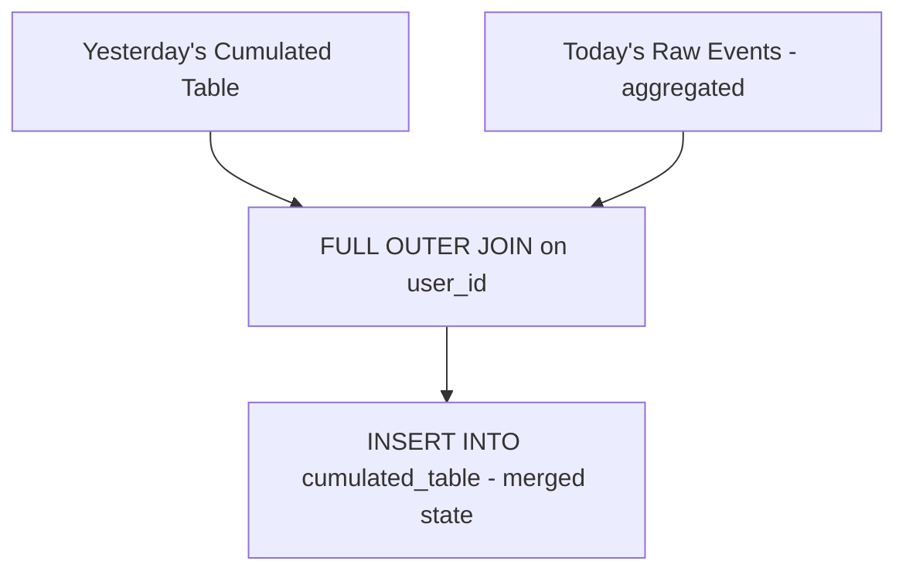
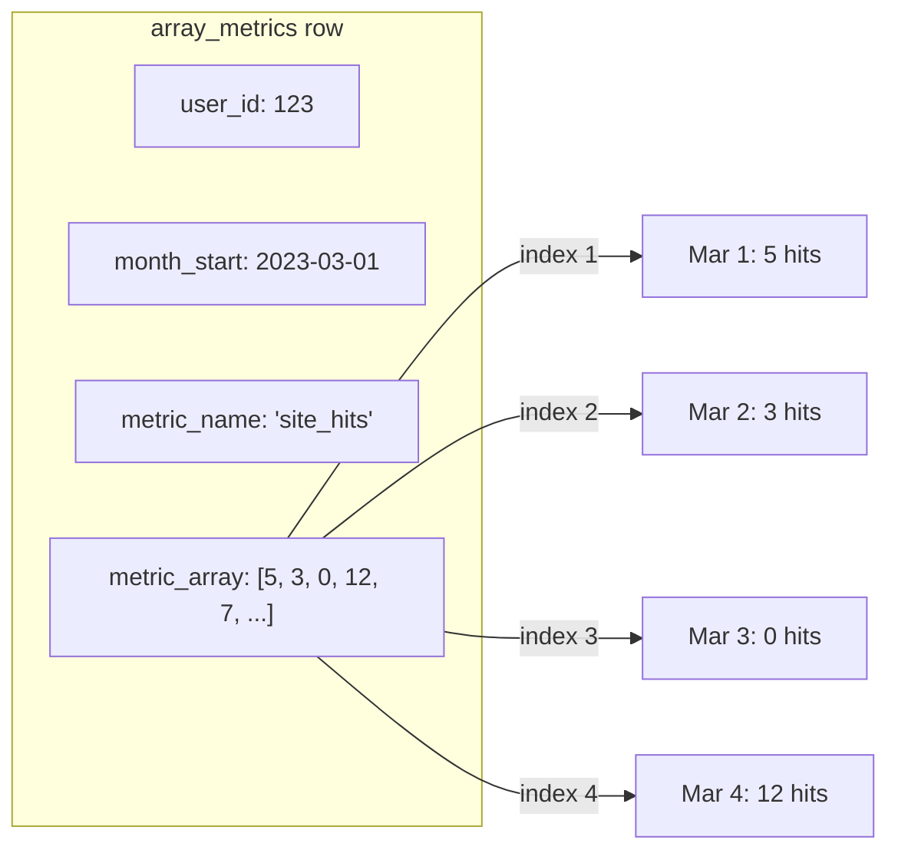
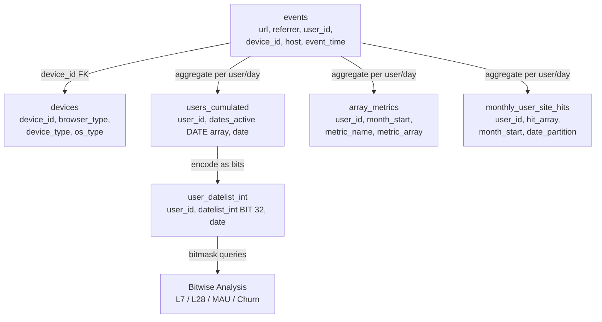
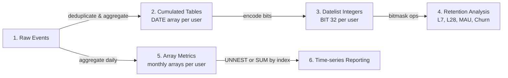

# Week 2: Fact Data Modeling

## Overview

Fact data modeling focuses on efficiently storing and querying event-level data (facts) using cumulative designs, bit manipulation, and array-based metrics. The goal is to enable fast analytical queries over time-series activity data without expensive daily re-scans.

---

## Key Concepts

### 1. Cumulative Table Design

A cumulative table maintains a running state per entity, updated incrementally each day. Instead of re-querying all historical data, you merge "yesterday's state" with "today's new events."



**Why FULL OUTER JOIN?**
- Users active yesterday but NOT today → carry forward their state
- Users active today but NOT yesterday → initialize their state
- Users active both days → merge/append today's data

---

### 2. Users Cumulated Table

Tracks which dates each user was active using a DATE array.

```sql
CREATE TABLE users_cumulated (
    user_id    BIGINT,
    dates_active DATE[],   -- array of active dates
    date       DATE,       -- partition date (latest snapshot)
    PRIMARY KEY (user_id, date)
);
```

**Population pattern:**

```
Day 1: user_id=1, dates_active=[2023-03-01], date=2023-03-01
Day 2: user_id=1, dates_active=[2023-03-01, 2023-03-02], date=2023-03-02
Day 3: user_id=1, dates_active=[2023-03-01, 2023-03-02], date=2023-03-03
                                 (no activity on day 3, array unchanged)
```

The query uses `COALESCE` to handle both new and returning users, appending today's date to the existing array only if the user had events today.

---

### 3. Datelist Integer (Bit Manipulation)

Converts the date array into a 32-bit integer where each bit represents a day's activity. This enables extremely fast analytical queries using bitwise operations.


**Encoding logic:**
- Bit position = `32 - days_since`
- Active day → `POW(2, 32 - days_since)` 
- Inactive day → 0
- Sum all powers → cast to `bigint::bit(32)`

**Example:** User active 0, 1, 2, and 7 days ago:
```
Bit pattern: 11100001000000000000000000000000
             ^^^    ^
             |||    └── 7 days ago
             ||└── 2 days ago
             |└── 1 day ago
             └── today
```

```sql
CREATE TABLE user_datelist_int (
    user_id      BIGINT,
    datelist_int BIT(32),
    date         DATE,
    PRIMARY KEY (user_id, date)
);
```

---

### 4. Bitwise Analysis Queries

Once you have the datelist_int, you can answer retention/activity questions with bitmask operations:

| Query | Bitmask | Expression |
|-------|---------|------------|
| Monthly Active (L32) | — | `BIT_COUNT(datelist_int) > 0` |
| Weekly Active (L7) | `11111110000000000000000000000000` | `BIT_COUNT(datelist_int & mask) > 0` |
| Previous Week Active | `00000001111111000000000000000000` | `BIT_COUNT(datelist_int & mask) > 0` |
| Daily Active (today) | `10000000000000000000000000000000` | `BIT_COUNT(datelist_int & mask) > 0` |

**Churn detection:** `weekly_active_previous_week = TRUE AND weekly_active = FALSE`

**Key benefit:** A single `SELECT` with bitmask operations replaces multiple expensive `COUNT(DISTINCT)` queries scanning raw event tables.

---

### 5. Array Metrics (Monthly Reduced Fact Table)

Stores per-user, per-month metrics as arrays where each index = day of month.

```sql
CREATE TABLE array_metrics (
    user_id      NUMERIC,
    month_start  DATE,
    metric_name  TEXT,         -- e.g., 'site_hits'
    metric_array REAL[],       -- index i = metric value on day i of month
    PRIMARY KEY (user_id, month_start, metric_name)
);
```



**Incremental load pattern:**
- `FULL OUTER JOIN` between yesterday's array state and today's aggregated events
- If user exists in yesterday → append today's value: `metric_array || ARRAY[new_val]`
- If user is new → backfill with zeros up to today: `ARRAY_FILL(0, ARRAY[days_to_fill]) || ARRAY[new_val]`
- Uses `ON CONFLICT ... DO UPDATE` for upsert/idempotency

---

### 6. Monthly User Site Hits (Alternative Array Pattern)

```sql
CREATE TABLE monthly_user_site_hits (
    user_id          BIGINT,
    hit_array        BIGINT[],     -- daily hit counts for the month
    month_start      DATE,
    first_found_date DATE,
    date_partition   DATE,         -- latest day loaded
    PRIMARY KEY (user_id, date_partition, month_start)
);
```

Partitioned by `date_partition` so you can query the latest snapshot and still access historical states. Aggregation is trivial:

```sql
SELECT month_start,
       SUM(hit_array[1]) AS num_hits_day_1,
       SUM(hit_array[2]) AS num_hits_day_2
FROM monthly_user_site_hits
WHERE date_partition = DATE('2023-03-03')
GROUP BY 1;
```

---

### 7. Cross-Joining with UNNEST for Analysis

To go from compressed array format back to a time-series view:

```sql
SELECT metric_name,
       month_start + CAST(CAST(index - 1 AS TEXT) || ' day' AS INTERVAL) AS date,
       elem AS value
FROM agg
CROSS JOIN UNNEST(agg.summed_array) WITH ORDINALITY AS a(elem, index);
```

This turns `[5, 3, 12]` back into rows:

| metric_name | date       | value |
|-------------|------------|-------|
| site_hits   | 2023-03-01 | 5     |
| site_hits   | 2023-03-02 | 3     |
| site_hits   | 2023-03-03 | 12    |

---

## Data Model Relationships



---

## Pipeline Progression



---

## Design Principles

| Principle | Description |
|-----------|-------------|
| **Incremental over full-scan** | Never re-process all history; merge yesterday + today |
| **Compression via arrays** | One row per user per month instead of one row per user per day |
| **Bit manipulation for speed** | 32-bit integers enable hardware-level aggregation |
| **Idempotency** | `ON CONFLICT DO UPDATE` ensures re-runs are safe |
| **Backfill handling** | `ARRAY_FILL` pads missing days for late-arriving users |
| **Date partitioning** | Snapshot-based tables allow time-travel queries |

---

## When to Use Each Pattern

| Need | Pattern | Why |
|------|---------|-----|
| "Was user active in last N days?" | Datelist Int + Bitmask | Single row scan, O(1) bitwise ops |
| "How many hits per day this month per user?" | Array Metrics | One row per user/month, fast SUM by index |
| "Track cumulative user activity over time?" | Cumulated Table (DATE[]) | Simple append, flexible downstream transforms |
| "Deduplicate raw event data?" | GROUP BY + aggregation before loading | Prevent double-counting in cumulative tables |
