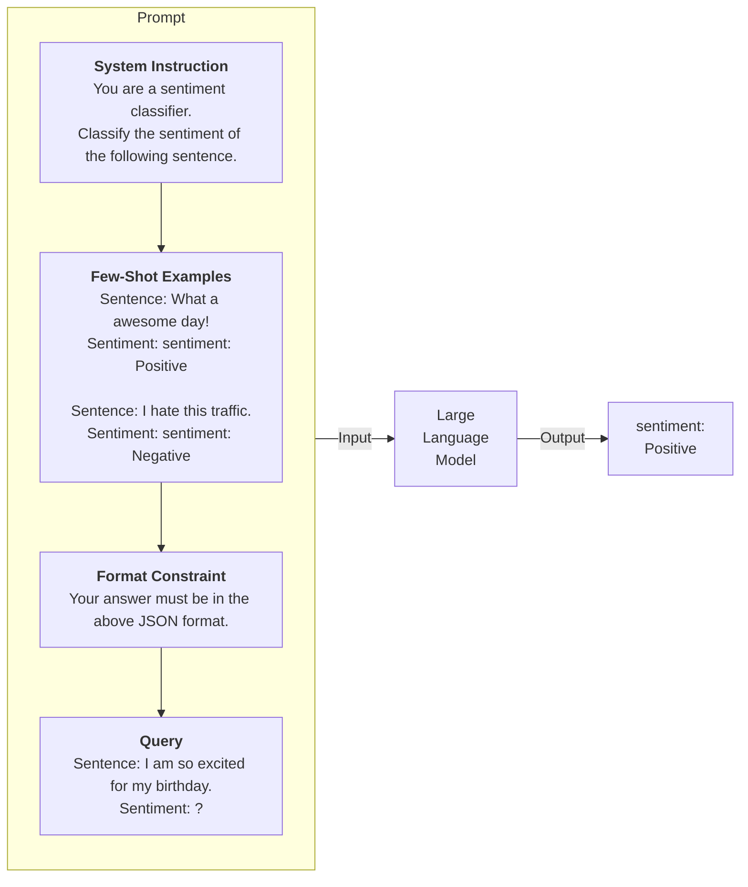
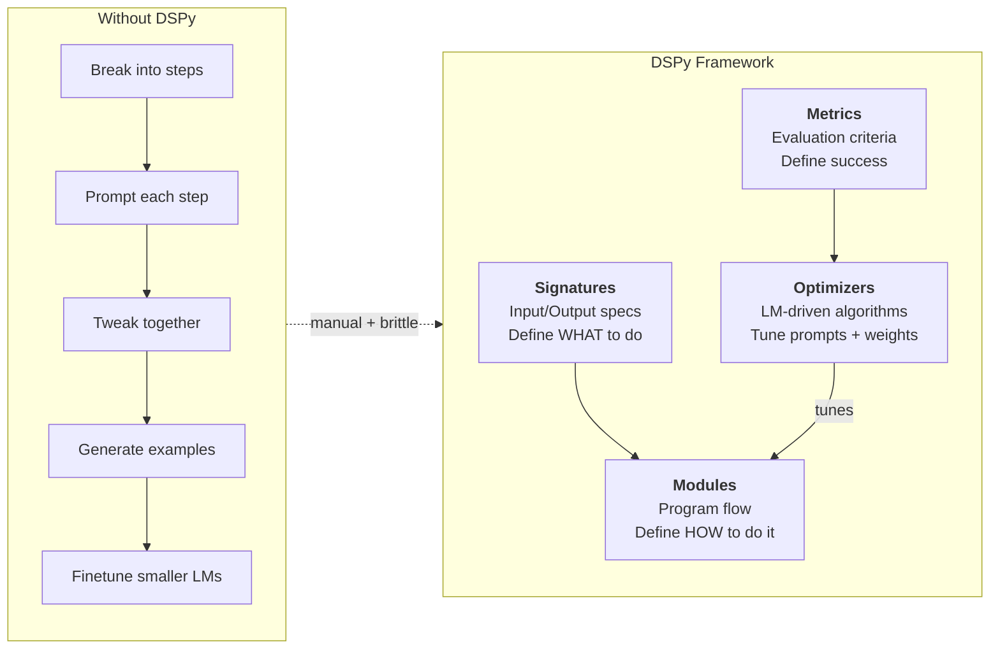
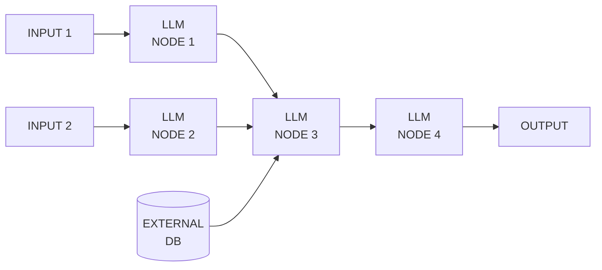
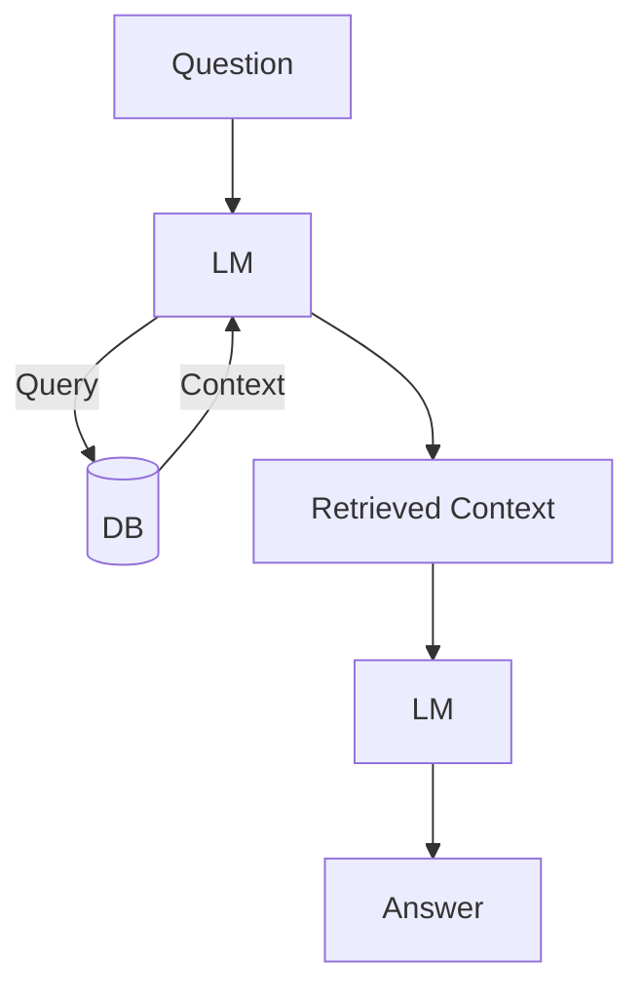
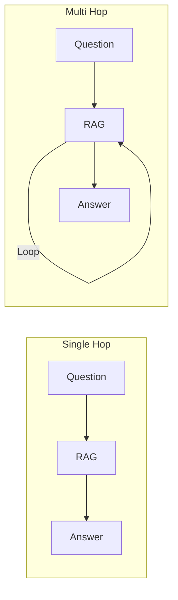
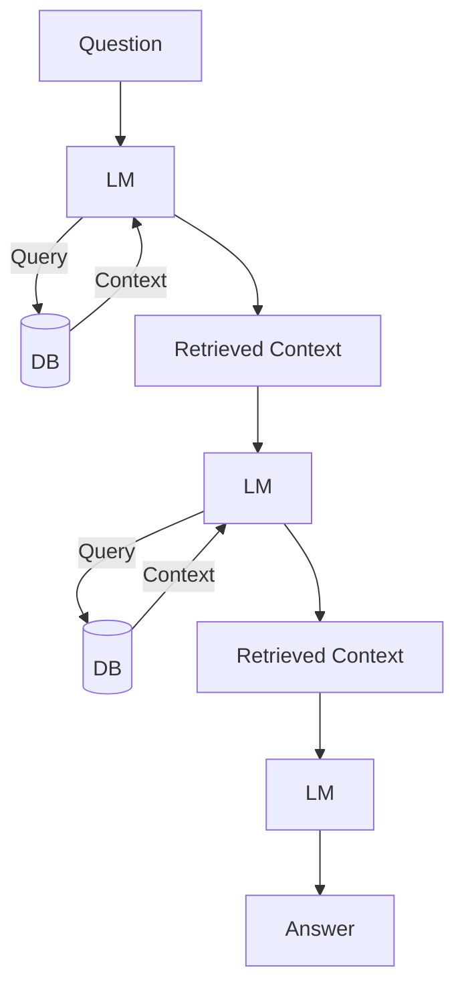
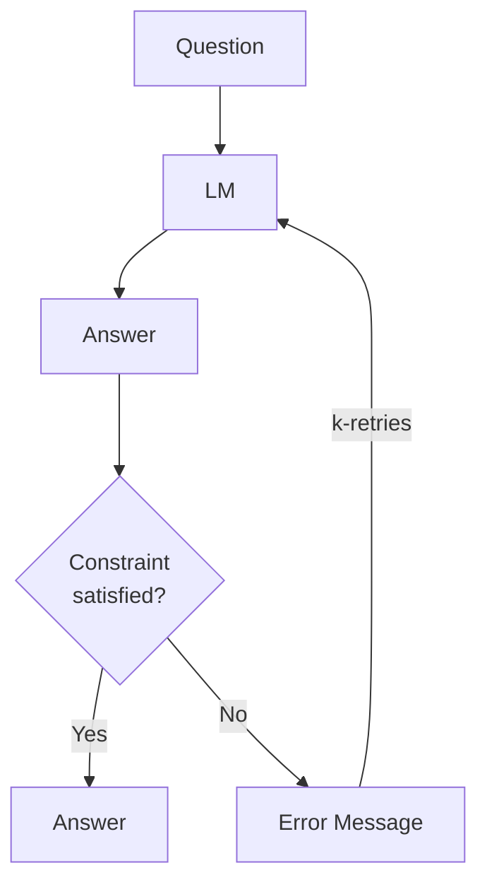
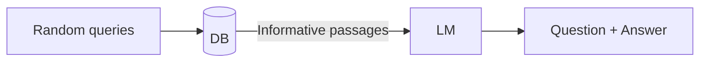
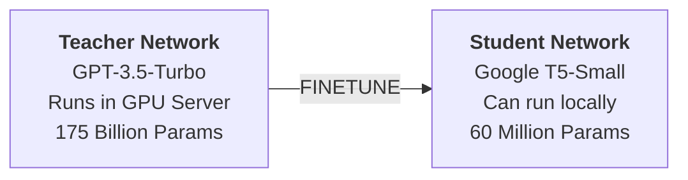

# DSPy Notes

## Prompt Engineering

Well structured text queries to extract information or solve tasks with LLMs.




## Foundations (0:47 - 5:55)

DSPy is a framework for algorithmically optimizing LM prompts and weights, especially when LMs are used one or more times within a pipeline.

**Without DSPy**, building a complex LM system requires you to:
1. Break the problem down into steps
2. Prompt your LM well until each step works well in isolation
3. Tweak the steps to work well together
4. Generate synthetic examples to tune each step
5. Use these examples to finetune smaller LMs to cut costs

This is hard and messy — every time you change your pipeline, LM, or data, all prompts (or finetuning steps) may need to change.

**DSPy makes this systematic** by doing two things:
- Separates program flow (`modules`) from parameters (LM prompts and weights)
- Introduces `optimizers` — LM-driven algorithms that tune prompts and/or weights given a `metric` to maximize

### Core Concept: Signatures and Modules

DSPy treats LLM applications as modules where **signatures** (input/output specifications) define *what* the model should do, and **modules** define *how* it should be done.




### Text Transformation Graphs

DSPy lets you design Text Transformation Graphs — pipelines of LLM nodes that can take multiple inputs, pull from external data sources, and chain together.




---

## 8 Examples Overview

Source: [DSPy in 8 Steps](https://www.youtube.com/watch?v=_ROckQHGHsU)

1. Basic QA (3:14)
2. Chain of Thought (6:20)
3. Predicting Typed Outputs (11:43)
4. Retrieval Augmented Generation - RAG (14:14)
5. Multi-Hop Reasoning (17:49)
6. Optimizers and Few-Shot Prompts (20:33)
6b. Assert and Suggest (23:54)
7. Generating Datasets (25:46)
8. Fine-tuning a T5 model (27:35)

---

## 2. Chain of Thought (6:20)

### Modules

A **DSPy module** is a building block for programs that use LMs.

- Each built-in module abstracts a **prompting technique** (like chain of thought or ReAct). They are generalized to handle any DSPy Signature.
- A DSPy module has **learnable parameters** (the little pieces comprising the prompt and the LM weights) and can be invoked to process inputs and return outputs.
- Multiple modules can be composed into bigger modules (programs). DSPy modules are inspired by NN modules in PyTorch, but applied to LM programs.

### Building Blocks

In DSPy, we maintain a clean separation between **defining your modules in a declarative way** and **calling them in a pipeline to solve the task**.

> If you have experience with PyTorch, you can think of DSPy as the PyTorch of the foundation model space.

Every call to the LM in a DSPy program needs to have a **Signature**. Using the Language Model: **Signatures & Predictors**.

### Single Chain of Thought

```python
class QA(dspy.Signature):
    """Given the question, generate the answer"""
    question = dspy.InputField()
    answer = dspy.OutputField(desc="often between 1 and 5 words")

class ChainOfThoughtModule(dspy.Module):
    def __init__(self):
        self.cot = dspy.ChainOfThought(QA)

    def forward(self, question):
        return self.cot(question=question)

multi_step_question = "What is the capital of the birth state of the person who provided the assist for the Mario..."
cot = ChainOfThoughtModule()
output = cot(question=multi_step_question)
```

**What it generates under the hood:**

```
Given the question, generate the answer
---
Follow the following format.

Question: User's question
Reasoning: Let's think step by step in order to ${produce the answer}. We ...
Answer: often between 1 and 5 words
---
Question: Who provided the assist for the goal in football world cup finals in 2014?
```

**Output:**
```
rationale="produce the answer. We know that the winning goal in the 2014 World Cup finals was scored by Mario Götze. The assist for that goal was provided by André Schürrle."
answer='André Schürrle'
```

### Double Chain of Thought

We can stack multiple LLM calls inside our Modules:

```python
class DoubleChainOfThoughtModule(dspy.Module):
    def __init__(self):
        self.cot1 = dspy.ChainOfThought("question -> step_by_step_thought")
        self.cot2 = dspy.ChainOfThought("question, thought -> one_word_answer")

    def forward(self, question):
        thought = self.cot1(question=question).step_by_step_thought
        answer = self.cot2(question=question, thought=thought).one_word_answer
        return dspy.Prediction(thought=thought, answer=answer)

multi_step_question = "What is the capital of the birth state of the person who provided the assist for the Mario Gotze's in football world cup finals in..."
doubleCot = DoubleChainOfThoughtModule()
output = doubleCot(question=multi_step_question)
```

**Output:**
```
rationale="produce the answer. We need to identify the player who provided the assist for Mario Gotze in the 2014 World Cup finals, then determine their..."
answer='Munich'
```

---

## 3. Typed Predictors (11:43)

Uses Pydantic to ensure the LLM returns structured data (floats, booleans, JSON schemas) instead of raw strings.

```python
import dspy
turbo = dspy.OpenAI(model='gpt-3.5-turbo')
dspy.settings.configure(lm=turbo)

from pydantic import BaseModel, Field

class AnswerConfidence(BaseModel):
    answer: str = Field("Answer. 1-5 words.")
    confidence: float = Field("Your confidence between 0-1.")

class QAWithConfidence(dspy.Signature):
    """Given user's question, answer it and also give your confidence value"""
    question = dspy.InputField()
    answer: AnswerConfidence = dspy.OutputField()

predict = dspy.TypedChainOfThought(QAWithConfidence)

question = "Who provided the assist for the goal in football world cup finals in 2014?"
output = predict(question=question)

print(output.answer)
print(output.answer.answer)
print(output.answer.confidence)
```

---

## 4. RAG & Multi-Hop Reasoning

### Retrieval Augmented Generation (14:14)

Include information from an external database into the prompt.



**DSPy RAG Implementation:**

```python
import dspy
turbo = dspy.OpenAI(model='gpt-3.5-turbo')
colbertv2_wiki17_abstracts = dspy.ColBERTv2(url='http://20.102.90.50:2017/wiki17_abstracts')
dspy.settings.configure(lm=turbo, rm=colbertv2_wiki17_abstracts)

# dspy.Retrieve lets you call nearest neighbors from vector databases
retrieve = dspy.Retrieve(k=3)
topK_passages = retrieve("André Schürrle").passages

class GenerateAnswer(dspy.Signature):
    """Answer questions with short factoid answers."""
    context = dspy.InputField(desc="may contain relevant facts")
    question = dspy.InputField()
    answer = dspy.OutputField(desc="often between 1 and 5 words")

class RAG(dspy.Module):
    def __init__(self, num_passages=3):
        super().__init__()
        self.retrieve = dspy.Retrieve(k=num_passages)
        self.generate_answer = dspy.ChainOfThought(GenerateAnswer)

    def forward(self, question):
        context = self.retrieve(question).passages
        prediction = self.generate_answer(context=context, question=question)
        return prediction

question = "What is the date of birth of the player who provided the assist for the final goal in football world cup finals in 2014?"
rag = RAG()
output = rag(question=question)
print(output)
```

**Supported Retrieval Model Clients:** ChromadbRM, ColBERTv2, MilvusRM, QdrantRM, Weaviate, AzureAISearch, Custom RM Client

### Multi-Hop Reasoning (17:49)

Retry multiple times to retrieve information from the Database.



**Multi-Hop detailed flow** — in a loop for K times: generate query from question, call DB to retrieve context:



**DSPy Multi-Hop Implementation:**

```python
import dspy
from dsp.utils import deduplicate
turbo = dspy.OpenAI(model='gpt-3.5-turbo')
colbertv2_wiki17_abstracts = dspy.ColBERTv2(url='http://20.102.90.50:2017/wiki17_abstracts')
dspy.settings.configure(lm=turbo, rm=colbertv2_wiki17_abstracts)

class GenerateQuery(dspy.Signature):
    """Generate search query from input question"""
    context = dspy.InputField(desc="may contain relevant facts")
    question = dspy.InputField()
    query = dspy.OutputField()

class GenerateAnswer(dspy.Signature):
    """Answer questions with short factoid answers."""
    context = dspy.InputField(desc="may contain relevant facts")
    question = dspy.InputField()
    answer = dspy.OutputField(desc="often between 1 and 5 words")

class MultiHop(dspy.Module):
    def __init__(self, passages_per_hop=3, max_hops=3):
        super().__init__()
        self.generate_query = [dspy.ChainOfThought(GenerateQuery) for _ in range(max_hops)]
        self.retrieve = dspy.Retrieve(k=passages_per_hop)
        self.generate_answer = dspy.ChainOfThought(GenerateAnswer)
        self.max_hops = max_hops

    def forward(self, question):
        context = []
        for hop in range(self.max_hops):
            query_response = self.generate_query[hop](context=context, question=question)
            query = query_response.query
            passages = self.retrieve(query).passages
            context = deduplicate(context + passages)

        pred = self.generate_answer(context=context, question=question)
        return dspy.Prediction(context=context, answer=pred.answer)
```


---

## 5. Optimizers & Few-Shot Prompts (20:33 - 23:54)

### Examples in DSPy

Working in DSPy involves training sets, development sets, and test sets. Like traditional ML, but you usually need far fewer labels (or zero labels) to use DSPy effectively.

- The core data type is `Example` — used to represent items in training/test sets
- `Example`s are similar to Python `dict`s with useful utilities
- DSPy modules return values of type `Prediction`, a special sub-class of `Example`

```python
import random
import ast
import dspy
random.shuffle(decisions_dataset)

trainset = decisions_dataset[:100]
testset = decisions_dataset[100:]

trainset = [dspy.Example(question=x["question"], answer=x["answer"]).with_inputs("question") for x in trainset]
testset = [dspy.Example(question=x["question"], answer=x["answer"]).with_inputs("question") for x in testset]
```

### Referee Decision Example

```python
class RefereeAnswer(dspy.Signature):
    """Choose a single the referee decision given the football situation in inputted."""
    question = dspy.InputField()
    answer = dspy.OutputField(desc="Choose between: Yellow card, Red card, Corner, Penalty, VAR, corner kick, warning")

class PredictModel(dspy.Module):
    def __init__(self):
        self.predict = dspy.ChainOfThought(RefereeAnswer)
    def forward(self, question):
        return self.predict(question=question)

turbo = dspy.OpenAI(model='gpt-3.5-turbo')
dspy.settings.configure(lm=turbo, trace=[])
predict = PredictModel()
```

### Evaluation

```python
from dspy.evaluate import Evaluate
from dspy.evaluate.metrics import answer_exact_match

evaluate_program = Evaluate(devset=testset, metric=answer_exact_match, num_threads=8, display_progress=True, display_table=10)
eval = evaluate_program(predict)
print(eval)
# Average Metric: 23 / 62 (37.1%)
```

### Optimizers (formerly Teleprompters)

A **DSPy optimizer** is an algorithm that can tune the parameters of a DSPy program (prompts and/or LM weights) to maximize the metrics you specify.

A typical DSPy optimizer takes three things:
- Your **DSPy program** (e.g., `dspy.Predict` or a complex multi-module program)
- Your **metric** — evaluates output and assigns a score (higher is better)
- A few **training inputs** — may be very small (5 or 10 examples), incomplete, without labels

```python
from dspy.teleprompt import BootstrapFewShot

# Set up a basic teleprompter, which will compile our program
teleprompter = BootstrapFewShot(metric=answer_exact_match, max_labeled_demos=10)

# Compile!
compiled_predictor = teleprompter.compile(predict, trainset=trainset)
# Bootstrapped 4 full traces after 6 examples in round 0.
```

> **Note:** For 100+ training examples, a better optimizer is `BootstrapFewShotWithRandomSearch` or the `MIPRO` optimizer.

---

## 6. Assertions & Suggestions (23:54 - 25:46)

Lets us add constraints to the LM's output.



After a fixed number of retries:
- **dspy.Suggest** — move on to the next operation (soft constraint)
- **dspy.Assert** — stop the program and throw an error (hard constraint)

### Without Assert/Suggest

```python
class PredictModel(dspy.Module):
    def __init__(self):
        self.predict = dspy.ChainOfThought(RefereeAnswer)
    def forward(self, question):
        output = self.predict(question=question)
        return dspy.Prediction(answer=output.answer)

predict_model = PredictModel()
predict_model(question="Potential offside on rebound")
# Prediction(answer='Offside')  -- not in allowed values!
```

### With Assert/Suggest

```python
class PredictModelAssert(dspy.Module):
    def __init__(self):
        self.predict = dspy.ChainOfThought(RefereeAnswer)
    def forward(self, question):
        output = self.predict(question=question)
        dspy.Suggest(
            output.answer.lower() in ("yellow card", "red card", "corner", "penalty", "VAR", "corner kick", "warning"),
            'Answer can only be one of the following: ("yellow card", "red card", "corner", "penalty", "VAR", "corner kick", "warning")'
        )
        return dspy.Prediction(answer=output.answer)

predict_assert_model = PredictModelAssert().activate_assertions()
predict_assert_model(question="Potential offside on rebound")
```

---

## 7. Dataset Generation (25:46 - 27:35)

Using an LLM to generate synthetic trivia datasets from a retrieval database.



```python
class GenerateQuestion(dspy.Signature):
    """Generate very simple trivia question from information"""
    information = dspy.InputField()
    question = dspy.OutputField(desc="Simple trivia Question.")
    answer = dspy.OutputField(desc="Answer to trivia question. 1 to 2 words.")

import random
def t():
    return dict(temperature=0.7 + 0.0001 * random.uniform(-1, 1))

class GenerateTrivia(dspy.Module):
    def __init__(self):
        self.retrieve = dspy.Retrieve(k=4)

    def forward(self, query):
        contexts = self.retrieve(query).passages
        answers = []
        for context in contexts:
            output = dspy.ChainOfThought(GenerateQuestion, **t())(information=context)
            answers.append({
                "context": context,
                "question": output.question,
                "answer": output.answer
            })
        return answers
```

Output saved to `trivia.csv` — generates questions like:
| question | answer |
|----------|--------|
| Which Premier League club does Cesc Fabregas currently play for? | Chelsea |
| Who scored the winning goal for Spain in the 2010 FIFA World Cup Final? | Andrés Iniesta |
| Who is the captain of FC Barcelona? | Andrés Iniesta |

---

## 8. Fine-tuning a T5 Model (27:35 - 33:45)

Transferring knowledge from a larger model to a smaller model.



**Goal:** Finetune a T5 model to:
- a. Query the ColBERTv2 DB given a quiz question
- b. Generate answer from the retrieved passages

### Setup

```python
import pandas as pd
import dspy

trivia_df = pd.read_csv("trivia.csv")[["question", "answer"]]
trainset = trivia_df.iloc[:-30].to_dict(orient="records")
testset = trivia_df.iloc[-30:].to_dict(orient="records")

trainset = [dspy.Example(question=x["question"], answer=x["answer"]).with_inputs("question") for x in trainset]
testset = [dspy.Example(question=x["question"], answer=x["answer"]).with_inputs("question") for x in testset]

turbo = dspy.OpenAI(model='gpt-3.5-turbo')
colbertv2_wiki17_abstracts = dspy.ColBERTv2(url='http://20.102.90.50:2017/wiki17_abstracts')
dspy.settings.configure(lm=turbo, rm=colbertv2_wiki17_abstracts, temperature=0.7)
```

### RAG Module for Fine-tuning

```python
import dspy
from pydantic import BaseModel, Field
from dsp.utils import deduplicate

class GenerateAnswer(dspy.Signature):
    """Answer questions with short factoid answers."""
    context = dspy.InputField(desc="may contain relevant facts")
    question = dspy.InputField()
    answer = dspy.OutputField(desc="often between 1 and 5 words")

class GenerateSearchQuery(dspy.Signature):
    """Write a simple search query that will help answer a complex question."""
    question = dspy.InputField()
    query = dspy.OutputField(desc="Name of person or event or entity which we need more information about. 1-2 words.")

class RAG(dspy.Module):
    def __init__(self):
        super().__init__()
        self.generate_query = dspy.Predict(GenerateSearchQuery)
        self.retrieve = dspy.Retrieve(k=2)
        self.generate_answer = dspy.Predict(GenerateAnswer)

    def forward(self, question):
        query = self.generate_query(question=question).query
        context = self.retrieve(query).passages
        pred = self.generate_answer(context=context, question=question)
        return dspy.Prediction(query=query, context=context, answer=pred.answer)
```

### Evaluation with GPT-3.5 (Teacher)

```python
# Custom metric using an LLM judge
class JudgeQA(dspy.Signature):
    """Given the question, determine if the two answers below mean the same"""
    question = dspy.InputField()
    answer1 = dspy.InputField()
    answer2 = dspy.InputField()
    are_they_same = dspy.OutputField(desc="Yes or No")

judgePredict = dspy.ChainOfThought(JudgeQA)
def metric(example, pred, trace=None):
    return judgePredict(question=example.question, answer1=example.answer, answer2=pred.answer).are_they_same.lower() == "yes"

evaluate_program = Evaluate(devset=testset, metric=metric, num_threads=8, display_progress=True, display_table=10)
eval = evaluate_program(RAG())
# Average Metric: 25 / 30 (83.3%)
```

### Fine-tuning T5-Small

GPT-3.5 has 175 Billion params. T5-Small has just 60 Million (0.0034x of GPT-3.5-Turbo).

**Without finetuning, T5-Small gets 0% answers correctly.**

```python
from dspy.teleprompt import BootstrapFinetune
tp = BootstrapFinetune(metric=None)

unlabeled_train = [dspy.Example(question=x.question).with_inputs("question") for x in trainset]
gpt_rag = RAG()

t5_small = dspy.HFModel(model='google-t5/t5-small')
t5_small.device = "mps"

t5_rag = RAG()
for p in t5_rag.predictors():
    p.lm = t5_small

config = dict(target='t5-small', epochs=10, bsize=8, accumsteps=2, lr=5e-5)
rag_t5_finetuned = tp.compile(student=t5_rag, teacher=gpt_rag, trainset=unlabeled_train, **config)
# Bootstrapped 310 full traces after 310 examples in round 0.
# all 620
```

### Results After Fine-tuning

The finetuned T5 model can now generate database queries and answers:

```python
answer = rag_t5_finetuned(question="Home of which football club is Emirates Stadium?")
# Query: Emirates Stadium
# Retrieved Context: ['Emirates Stadium | The Emirates Stadium...is the home of Arsenal Football Club']
# Answer: Arsenal Football Club

answer = rag_t5_finetuned(question="Where did the UEFA Euro 2008 take place?")
# Query: UEFA Euro 2008
# Retrieved Context: ['UEFA Euro 2008 | ...commonly referred to as UEFA Euro 2008...']
# Answer: Austria and Switzerland
```

**Pre-fine-tune: 0/30 → Post-fine-tune: significant improvement** with a model that's 0.0034x the size of the teacher.
